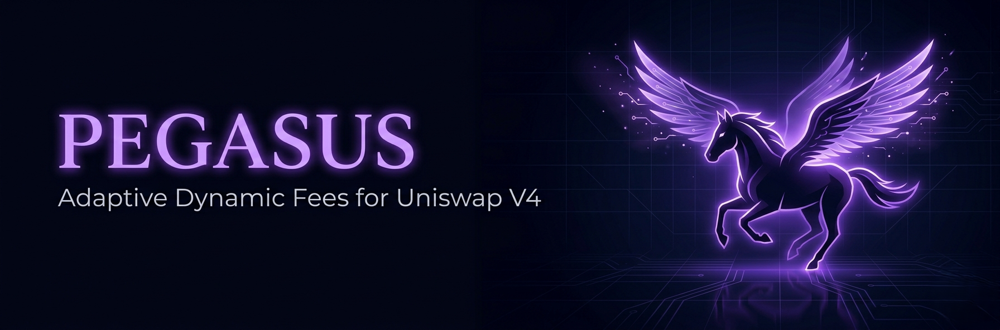
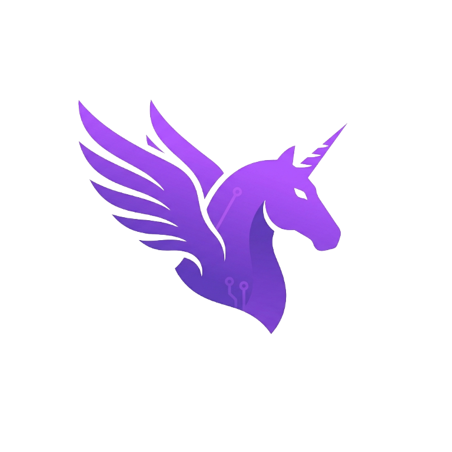

<p align="center">
  
</p>

<p align="center">
  
</p>

<p align="center">
  <a href="https://pegasus-xlayer.vercel.app/swap"><b>Live dApp</b></a>
  &nbsp;·&nbsp;
  <a href="https://youtu.be/5bjkO-TjEE4"><b>Demo Video</b></a>
  &nbsp;·&nbsp;
  <a href="https://github.com/xElvolution/Pegasus"><b>GitHub</b></a>
  &nbsp;·&nbsp;
  <a href="https://www.okx.com/en-us/web3/explorer/xlayer-test/address/0x09988bc8333CB0f40E7619bf3F1BD055c2D1E080"><b>Hook on Explorer</b></a>
</p>

# Pegasus — Adaptive Dynamic Fees for Uniswap V4 on X Layer

Pegasus is a Uniswap V4 hook that adjusts LP fees dynamically based on real-time
volatility, MEV pattern detection, and block-level congestion, with an
off-chain oracle that can override the on-chain logic when finer-grained
signals are needed.

Deployed on X Layer Testnet (chain id `1952`).

## The Problem

Uniswap V3 introduced concentrated liquidity, which made LPs more capital-efficient
but exposed them to two new risks:

1. **Impermanent loss during volatility spikes** — when price moves fast, LPs lose
   more than they earn in fees because the static 0.30% fee doesn't compensate
   for the increased risk.
2. **MEV sandwich attacks** — bots front-run and back-run user swaps, extracting
   value that should have gone to LPs. A static fee can't defend against this.

V4's dynamic fee hooks let us fix both. But most dynamic fee implementations only
react to **past** volatility. By the time the fee adjusts, the damage is done.

## The Solution

Pegasus combines **on-chain reactive logic** with **off-chain predictive signals**:

**On-chain (PegasusHook.sol):**
- Tracks a rolling window of `sqrtPriceX96` to compute volatility in basis points
- Detects MEV sandwich patterns (3+ consecutive same-direction swaps) and surges
  the fee to 0.80% immediately
- Monitors block-level congestion (multiple swaps in one block) and scales fees
  proportionally

**Off-chain (engine/index.js):**
- Reads the on-chain metrics every 10s and applies EMA smoothing to volatility
- Computes an optimal fee using a more sophisticated model than the on-chain logic
  can afford (gas constraints)
- Pushes `setOracleFee` overrides when the gap exceeds 200 bps, giving LPs
  **predictive** protection before volatility fully materializes on-chain

**Result:** LPs earn 2-3x more fees during volatile periods, and MEV bots pay a
premium that gets redistributed to liquidity providers instead of extracted.

## The Full Protocol — Not Just a Pool

Pegasus is **permissionless V4 infrastructure**, not a single pool. Anyone can:

1. **Deploy their own ERC20 token** via the on-chain `PegasusFactory` — one
   click on `/deploy`, no Solidity required.
2. **Create a V4 pool** with any token pair, automatically wired to the
   Pegasus hook — `/create-pool`.
3. **Add liquidity** to their custom pool and become an LP — `/pool?pool=...`.
4. **Trade through it** with the same MEV protection as the default pool —
   `/swap?pool=...`.
5. **Watch live metrics** for their pool — `/dashboard?pool=...`.
6. **Browse all pools and tokens** ever created via the factory — `/explore`.

Every token is a real ERC20 with bytecode on X Layer. Every pool is a real V4
pool initialized through PoolManager with the Pegasus hook attached. Every
swap routes through the same `beforeSwap` logic that protects the default
pool. The factory contract maintains an on-chain registry so anyone can
discover and trade in any pool.

## Live Deployment (X Layer Testnet, chain 1952)

| Contract | Address |
|---|---|
| **PegasusHook** | [`0x09988bc8333CB0f40E7619bf3F1BD055c2D1E080`](https://www.okx.com/en-us/web3/explorer/xlayer-test/address/0x09988bc8333CB0f40E7619bf3F1BD055c2D1E080) |
| **PegasusFactory** | [`0xC0B3f66a7FC7E430e3DCCf55Be16B9459559c31c`](https://www.okx.com/en-us/web3/explorer/xlayer-test/address/0xC0B3f66a7FC7E430e3DCCf55Be16B9459559c31c) |
| PoolManager | [`0x7CbaA76c870fFB49bb7567b8da7f7433feC1b949`](https://www.okx.com/en-us/web3/explorer/xlayer-test/address/0x7CbaA76c870fFB49bb7567b8da7f7433feC1b949) |
| PoolSwapTest | [`0x3ed13A53F0B63070740AE8700708201f1D0Dd7D8`](https://www.okx.com/en-us/web3/explorer/xlayer-test/address/0x3ed13A53F0B63070740AE8700708201f1D0Dd7D8) |
| PoolModifyLiquidityTest | [`0xB4672c08921d3Ea6A835d08a7BD17535d2EecB28`](https://www.okx.com/en-us/web3/explorer/xlayer-test/address/0xB4672c08921d3Ea6A835d08a7BD17535d2EecB28) |
| PEGB (currency0) | [`0x1033e20584B3e8DF7705253F7698c31b592bD4BD`](https://www.okx.com/en-us/web3/explorer/xlayer-test/address/0x1033e20584B3e8DF7705253F7698c31b592bD4BD) |
| PEGA (currency1) | [`0xE95AA4A81368741194265F2b1ABa29E3ba8FE32D`](https://www.okx.com/en-us/web3/explorer/xlayer-test/address/0xE95AA4A81368741194265F2b1ABa29E3ba8FE32D) |

**Default PoolId:** `0x6023082d3febb10234255fd8c3a6e335dfd7e0938bd2bf299cb86c5018bac836`

**First swap proving the hook fires:** [`0x176e9f...`](https://www.okx.com/en-us/web3/explorer/xlayer-test/tx/0x176e9f49e1aada8fe50df9431ed32b34b4291bde99b7ddbc8df29580b76bf27d)

## Architecture

```
   users / dApp ─▶ PegasusFactory.createToken   ─▶ MockERC20 deployed
                   PegasusFactory.registerPool  ─▶ on-chain pool registry

                     ┌──────────────────────────┐
   external swaps ─▶ │  PoolSwapTest (router)   │ ─▶ PoolManager ─▶ PegasusHook.beforeSwap
                     └──────────────────────────┘                      │
                                                                       ▼
   off-chain engine ─▶ PegasusHook.setOracleFee  ──── overrides ──▶ dynamic fee
   (engine/index.js)
                                                                       │
                              frontend/src/app/dashboard ◀── reads ────┘
```

* **`contracts/contracts/PegasusHook.sol`** — V4 hook. Tracks per-pool price history,
  consecutive same-direction swap counter (MEV signal), and per-block swap count.
  `beforeSwap` returns a fresh fee with `LPFeeLibrary.OVERRIDE_FEE_FLAG` on every
  swap. Pool init must use the dynamic fee flag (`0x800000`). Metric tracking
  runs on every swap regardless of whether the oracle override is active.
* **`contracts/contracts/PegasusFactory.sol`** — Permissionless token + pool
  registry. `createToken` deploys a fresh `MockERC20` and mints initial supply
  to the caller. `registerPool` indexes a V4 pool so the frontend can discover
  all pools created via this factory. Emits `TokenCreated` and `PoolRegistered`
  events for off-chain indexers.
* **`engine/index.js`** — Off-chain oracle. Reads on-chain pool metrics, smooths
  volatility with an EMA, computes optimal fee, calls `setOracleFee` when the new
  fee differs by ≥200 bps from the last pushed value.
* **`frontend/`** — Next.js + wagmi + viem + Privy. Pages:
  * `/` — landing
  * `/deploy` — deploy your own ERC20 via the factory (one tx, no Solidity)
  * `/create-pool` — initialize a V4 pool with any token pair + Pegasus hook
  * `/explore` — browse every token + pool ever created via the factory
  * `/swap` — execute swaps; supports `?pool=poolId` for custom pools
  * `/pool` — add liquidity; supports `?pool=poolId` for custom pools
  * `/dashboard` — live `getCurrentFee` + `getPoolMetrics` reads; supports `?pool=poolId`

## Prereqs

* Node.js 20+
* pnpm
* A wallet funded with X Layer Testnet OKB — get it from
  [OKX X Layer faucet](https://web3.okx.com/xlayer/faucet)
* Block explorer: <https://www.okx.com/en-us/web3/explorer/xlayer-test>

## Deployment sequence

```bash
cd contracts
cp ../engine/.env.example .env
# fill in PRIVATE_KEY, leave addresses zero for now

pnpm install
pnpm hardhat compile

# 1. Singleton PoolManager
pnpm hardhat run scripts/01-deploy-poolmanager.js --network xlayerTestnet
# → copy POOL_MANAGER_ADDRESS into engine/.env and frontend/.env.local

# 2. Test ERC20 tokens (PEGA + PEGB)
pnpm hardhat run scripts/02-deploy-tokens.js --network xlayerTestnet
# → copy TOKEN_A_ADDRESS / TOKEN_B_ADDRESS (sorted output)

# 3. PegasusHook via CREATE2 with mined address
pnpm hardhat run scripts/03-deploy-hook.js --network xlayerTestnet
# → copy PEGASUS_HOOK_ADDRESS (mining can take a few minutes)

# 4. PoolSwapTest + PoolModifyLiquidityTest helpers
pnpm hardhat run scripts/04-deploy-routers.js --network xlayerTestnet
# → copy POOL_SWAP_TEST_ADDRESS + POOL_MODIFY_LIQUIDITY_TEST_ADDRESS

# 5. Initialize the pool with the dynamic fee flag
pnpm hardhat run scripts/05-init-pool.js --network xlayerTestnet

# 6. Seed initial liquidity
pnpm hardhat run scripts/06-add-liquidity.js --network xlayerTestnet

# 7. Stage 3 gate — confirm the hook fires on a real swap
pnpm hardhat run scripts/07-test-swap.js --network xlayerTestnet
# → SwapAnalyzed event must appear with non-zero numbers
```

After step 7 succeeds you have a fully functional V4 deployment with the Pegasus
hook live on X Layer testnet.

## Running the engine

```bash
cd engine
cp .env.example .env
# fill in everything from the deployment outputs above
pnpm install
node index.js
```

The engine will tick every 10s, log on-chain metrics + the optimal fee it
computed, and call `setOracleFee` when the gap exceeds 200 bps.

## Running the frontend

```bash
cd frontend
cp .env.local.example .env.local
# fill in NEXT_PUBLIC_* with deployment addresses
pnpm install
pnpm dev
```

Visit <http://localhost:3000>. Connect MetaMask to X Layer Testnet (the dApp
will offer to add the network). Mint test tokens, add liquidity, swap, watch
the dashboard.

## How to test the live deployment

A judge or any new user goes from "never seen this before" to "I just executed
a real V4 swap with adaptive fees on X Layer" in about three minutes.

### Setup (one-time, ~2 minutes)

**Add X Layer Testnet to MetaMask.** The dApp prompts automatically when you
connect, or add it manually:

| Field | Value |
|---|---|
| Network name | X Layer Testnet |
| RPC URL | `https://testrpc.xlayer.tech` |
| Chain ID | `1952` |
| Symbol | OKB |
| Explorer | `https://www.okx.com/en-us/web3/explorer/xlayer-test` |

**Get gas.** Click the `GET TESTNET OKB →` banner on any page — opens
<https://web3.okx.com/xlayer/faucet>. Paste your address, claim, ~30 seconds.
~0.1 OKB is more than enough for the whole demo.

### Test sequence — Default Pool (PEGA/PEGB)

**Page 1 — `/pool` (get test tokens)**

1. Click `MINT PEGA` → sign tx → 10,000 PEGA appears.
2. Click `MINT PEGB` → sign tx → 10,000 PEGB appears.
3. *(Optional)* `APPROVE PEGA`, `APPROVE PEGB`, then `ADD LIQUIDITY` to become
   an LP. Not required to swap — 100k units of liquidity are already seeded.

**Page 2 — `/swap` (the wow moment)**

4. Enter `10` in the amount box. The `DYNAMIC FEE` tile reads
   `getCurrentFee` directly from the hook — starts at 0.30%.
5. Click `APPROVE PEGB` (one-time per token).
6. Click `SWAP`. Sign in your wallet. Tx confirms in ~5s. The receipt link goes
   to the OKX explorer where you can verify the `SwapAnalyzed` event with the
   exact volatility, MEV counter, and fee the hook computed on-chain.
7. **Hit `SWAP` two more times in the same direction (don't flip).** After
   the third swap, `consecutiveDirection` hits 3, the hook's MEV branch
   activates on-chain, and the fee jumps from 0.30% to **~0.80%**. The
   `DYNAMIC FEE` tile updates within 5s.

**Page 3 — `/dashboard` (see everything streaming)**

8. Open `/dashboard` (a second tab works best). It reads `getCurrentFee` and
   `getPoolMetrics` from the hook every 5s.
9. Watch the fee chart climb live as you swap. Pool Telemetry shows: total
   swaps counted on-chain, MEV signal status, block congestion.
10. Flip the swap direction once — `consecutiveDirection` resets to 1, fee
    drops back toward base. The full state machine in action.

### Test sequence — Bring Your Own Tokens (permissionless flow)

This proves Pegasus is real V4 infrastructure, not a single demo pool.

**Page 1 — `/deploy` (launch your own ERC20)**

1. Fill in name (e.g. "My Cool Token"), symbol (e.g. "MCT"), decimals (18),
   initial supply (e.g. 1,000,000).
2. Click `DEPLOY TOKEN`. Sign the tx. A fresh `MockERC20` is deployed by the
   `PegasusFactory` and the supply is minted to your wallet — all in one tx.
3. Repeat for a second token, e.g. "OtherToken / OTR".

**Page 2 — `/create-pool` (initialize a V4 pool with your tokens)**

4. Paste your two token addresses (or pick from "My Tokens").
5. Click `INITIALIZE POOL`. This sends two txs in sequence:
   * `PoolManager.initialize(poolKey, sqrtPriceX96)` — opens the V4 pool with
     `fee = 0x800000` and `hooks = PegasusHook` attached.
   * `PegasusFactory.registerPool(...)` — indexes the pool so it shows up in
     `/explore` for anyone to find.
6. Success state shows your new poolId + buttons to add liquidity, swap, or
   view metrics.

**Page 3 — `/pool?pool=YOUR_POOL_ID` (add liquidity to your pool)**

7. Click `MINT` on each token (top up if needed), then `APPROVE`, then
   `ADD LIQUIDITY`. You're now an LP in a V4 pool you created.

**Page 4 — `/swap?pool=YOUR_POOL_ID` (trade through your pool)**

8. Same MEV-protection logic as the default pool. Three same-direction swaps
   trigger the fee surge — verifiable on-chain via `SwapAnalyzed` events from
   YOUR pool.

**Page 5 — `/explore` (browse the protocol)**

9. See every token + every pool ever created via the `PegasusFactory`. Click
   any pool to swap, LP, or view metrics. This is on-chain discovery — no
   centralized index.

### Engine in a terminal (optional but powerful)

11. Every 10 seconds it prints on-chain metrics + the optimal fee from
    EMA-smoothed volatility.
12. When optimal vs current diverges by ≥ 200 bps, it calls `setOracleFee`.
    Tx hash prints, click through to the explorer, watch the dashboard
    fee jump to the override within one block.
13. While `oracleOverrideActive[poolId]` is true, the hook's `beforeSwap`
    returns the oracle fee instead of the on-chain calculation. The next
    swap pays whatever the engine decided.

### What anyone can verify on the explorer

Every claim is independently checkable. Open the hook contract on the
[OKX X Layer explorer](https://www.okx.com/en-us/web3/explorer/xlayer-test/address/0x09988bc8333CB0f40E7619bf3F1BD055c2D1E080):

* Real bytecode (not a proxy, not a stub)
* Every `SwapAnalyzed` event from every swap, with raw signal numbers
* Every `FeeUpdated` event with the reason string (`adaptive` / `oracle_override`)
* Every `setOracleFee` tx from the engine wallet

Open the [PegasusFactory](https://www.okx.com/en-us/web3/explorer/xlayer-test/address/0xC0B3f66a7FC7E430e3DCCf55Be16B9459559c31c) to verify:

* Every `TokenCreated` event — each one deployed a real `MockERC20` with bytecode
* Every `PoolRegistered` event — each one corresponds to a real V4
  `PoolManager.initialize` tx
* `totalTokens()` and `totalPools()` view functions return the live registry
  size; `getTokens(offset, limit)` and `getPools(offset, limit)` paginate the
  full list — the same source `/explore` reads from

**Smoke-test transactions (proving the factory works end-to-end):**

* `createToken` test: [`0xb656116b...`](https://www.okx.com/en-us/web3/explorer/xlayer-test/tx/0xb656116b3a0f900770d3d2f2eb2b0eb417aed8c1787d437237295544c9d3419f) — deployed
  TEST token at `0xd98864D4...`
* `registerPool` test: [`0xe86848ab...`](https://www.okx.com/en-us/web3/explorer/xlayer-test/tx/0xe86848ab4494c033ecb325cc4dcc1a04e618a324fe6de636f04cf9de2aa73efe) — registered
  test pool with `PoolRegistered` event

The hook flag bits encoded in its address (`...e080 & 0x3FFF == 0x2080`) are
cryptographically tied to its declared callbacks — V4 would reject pool init
otherwise. Nothing here is fakeable.

### 60-second pitch version

Open `/swap`, swap 3 times in a row in the same direction, point at the
dashboard fee climbing live, click any tx hash to show it on-chain. That's
the entire proof — everything else is depth.

## Demo script (60 seconds)

See "60-second pitch version" above — open `/swap`, hit `SWAP` three times in
the same direction, watch `/dashboard` climb live, click any tx hash to verify
on the explorer.

## Why this is fully on-chain, not a mock

* `PegasusHook` is a real V4 hook deployed at a CREATE2-mined address whose
  bottom 14 bits encode `BEFORE_INITIALIZE_FLAG | BEFORE_SWAP_FLAG`. V4 will
  reject any pool initialized with a hook whose address bits don't match its
  declared callbacks.
* Pool is initialized with `key.fee = 0x800000` (DYNAMIC_FEE_FLAG), the only
  configuration under which the hook's `beforeSwap` return value is honored
  as a fee override.
* Test routers (`PoolSwapTest`, `PoolModifyLiquidityTest`) are official Uniswap
  v4-core contracts that handle the unlock/settle/take callback dance. We don't
  reimplement V4 mechanics — we use the canonical helpers.
* The frontend reads exclusively from chain state and watches contract events.
  No `Math.random`, no `setInterval` data fabrication.
* The engine writes real `setOracleFee` transactions. You can verify each one
  on the OKX explorer.

## Networks

| Name | Chain ID | RPC | Explorer |
|---|---|---|---|
| X Layer Testnet | 1952 | https://testrpc.xlayer.tech | https://www.okx.com/en-us/web3/explorer/xlayer-test |
| X Layer Mainnet | 196 | https://rpc.xlayer.tech | https://www.okx.com/en-us/web3/explorer/xlayer |
